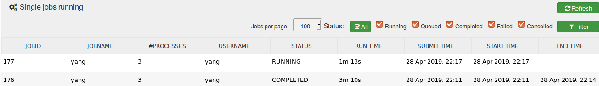
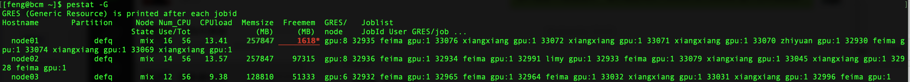
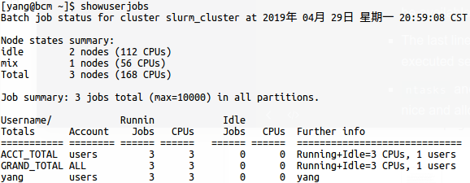

# How to Use Our New Cluster 

Version 3.0

---------------------------------------

**Changelog**:

* Removed web browser access since it is super laggy
* Disabled ssh between nodes since we are moving to slurm for GPU management
* Clarified instructions on module load
* Added instructions on using slurm interactively with srun

Known issues:

* /data1 and /data2 are not yet writable to all users
* Needs more testing and documentation on using multiple GPUs 

## 1. Access the cluster

Connect to the server with ssh:

```bash
> ssh -Y [username]@10.8.4.170
```

* `username` is the same user name you had on the old server .  

* `-Y` is optional for opening the X11 display

* The default password is `123456`

IMPORTANT: Once you log in, reset password using the passwd tool and follow the prompt.  

```bash
> passwd 
```

## 2. Where are my files?

Your home directory is located at `/home/[username]`.  It contains the following:

* System created directories, such as Desktop, Document, Download etc
* All files from your home directory on the old server.  
* If you have stored files on `/data` or `/data/users` of the old server, you can find those files in `/home/[username]/_data` . 

In addition, `/data/datasets` is now located at `/home/dataset`. 

## 3. First look of the BCM Cluster 

Our cluster has 5 nodes (servers) :

* `bcm`:  log-in server with ip address 10.8.4.170.  
* `node01` : computing node with 8 TITAN V GPUs, 256GB RAM
* `node02`: computing node with 8 TITAN V GPUs, 256GB RAM
* `node03` : computing node with 4 Telsa K80 GPU cores and 2 TITAN V GPUs, 128GB RAM, fastest CPU among all nodes
* a storage node that hosts the 77T file system `/home` (should not be accessed directly) 

As a user, you will only have access to the `bcm` node. To take advantage of the computing resources on nodes 1-3, you will need to use the SLURM workload manager.   (See Section 5.)

Unlike the old server, your home directory on the BCM cluster are totally invisible to other users. Nevertheless, you can place shared files in 

*  `/home/dataset` : save large public datasets here 
* `/data1`: 5T temporary storage space 
* `/data2`: 5T temporary storage space

## 4. Setup a working environment

### Load modules

BCM allows each user to customize their working environment, such as choosing different software version, through "module" commands. 

For example, the default python version is 2.7. To use python 3, you need to load the `anaconda3 /py3` module.

```shell
module add anaconda3/py3
```

This adds anaconda 3 to your current session.  Now you can use Python 3.6 by typing `python`. To make this module load every time you log in, type

```
module initadd anaconda3/py3
```

You can also directly add the module to your session profile. i.e.  add the following line to the end of `~/.bashrc` ( a script that runs at the start of every new terminal session)

``` 
module load anaconda3/py3 
```

To make your code work on the cluster, you will likely need additional modules, such as

- `cuda90/toolkit/9.0.176` is needed for NVIDIA tools  
- `cudnn/7.0` is needed for using the GPUs for deep learning
- `openmpi` is for parallel processing, also used by deep learning libraries such as tensorflow   

Here is a sample `.bashrc` file that include all the above packages:

```bash
# .bashrc

# Source global definitions
if [ -f /etc/bashrc ]; then
	. /etc/bashrc
fi

# Uncomment the following line if you don't like systemctl's auto-paging feature:
# export SYSTEMD_PAGER=

# User specific aliases and functions
module load gcc anaconda3/py3 cuda90/toolkit/9.0.176 cudnn/7.0 openmpi/cuda/64/3.1.1
module load slurm 
```

The last two lines is where modules are loaded.  `gcc` is the C compiler, `slurm` is the workload manager (this line is added by default)

After you modify `.bashrc`, use

```
soure .bashrc
```

to make the change take into effect in your current session. Alternatively, you can simply start a new session by re-logging.

### C++ developer

See [cpp.md](./cpp.md) for detail.

### Python packages

If you need any additional Python packages, please ask the admins to have them installed. Alternatively, you can download and install Anaconda inside your own home directory.   

## 5. How to use GPUs

We will use SLURM to submit GPU jobs to the cluster. It automatically allocates GPU/CPU resources to you based on your requests. 

### Using srun

For interactive development, you can use `srun`  to submit a single job.

```
srun --gres=gpu:1 [command]
```

* `--gres=gpu:1` requests one GPU for running the code. 
* `[command]` can be any terminal command such as `python test.py` or `nvidia-smi` 

Note that setting `--gres=gpu` to more than one will NOT automatically make your code faster! You also need to make sure your code supports multiple GPUs. See the following links on how to achieve this.

* Keras: https://keras.io/getting-started/faq/#how-can-i-run-a-keras-model-on-multiple-gpus
* Tensorflow: https://www.tensorflow.org/guide/using_gpu#using_multiple_gpus
* Pytorch: https://pytorch.org/tutorials/beginner/former_torchies/parallelism_tutorial.html

Each user is currently limited to use at most 6 GPUs at a time. We may adjust this limit later depending on the cluster usage. 

### Using sbatch

While `srun` executes commands in real time, `sbatch` schedules your job for later execution. Therefore it is good for longer training jobs. e.g. You can submit as many jobs as you want to the slurm queue, and each job will be executed as soon as resources become available.  

To submit a job, you need to wrap terminal commands within a `sbatch` script.   Suppose you want to run a GPU program `test.py`. First create a new file  `submit_jobs.sh`  with the following content:

```bash
#!/bin/bash
#SBATCH -J yang       # job name
#SBATCH -p defq       # partition name (should always be defq)
#SBATCH -N 1          # number of computing node (should always be 1)
#SBATCH --ntasks=1    # maximum number of parallel tasks (processes) 
#SBATCH --gres=gpu:1  # number of gpus allocated on each node
#SBATCH -t 105:00     # maximum running time in hh:mm:ss format

python test.py    
```

* Lines starting with `#BATCH` are slurm allocation requests. In this example, we created a job named "yang" on the default queue (defq), allocated one computing node with one CPU core and one GPU per node. The allocation will be available for a maximum of 105 minutes.
* The last line `python test.py` is the command to be run. If multiple commands are listed, they will be always be executed sequentially, NOT in parallel. 
* `ntasks` and `--gres=gpu` should be 1 unless your code have multi-GPU support.  When using multiple GPUs, be nice and allocate no more than a few.  

Make the script executable by

```bash
chmod a+x submit_jobs.sh
```

Then submit the job with `sbatch`

```bash
[yang@node01 ~]$ sbatch submit_jobs.sh                   
Submitted batch job 177
```

 The output log of this job will be saved to  `slurm-[jobID].out` in the current directory. A useful way to display the log in real time is via the tail command. e.g

```
tail -f slurm-177.out
```

To exit, use Ctrl-C.

### View and Cancel jobs

You can view the job queue using `squeue`. (This applies to all jobs submitted with `srun` or `sbatch`)  

```bash
[yang@bcm ~]$ squeue
             JOBID PARTITION     NAME     USER ST       TIME  NODES NODELIST(REASON)
               177      defq     yang     yang  R       0:30      1 node01 
```

* The column named ST displays the status of your job. 'R' stands for running and 'PD' stands for pending (waiting for resource).

You can also monitor your jobs in a web browser. Visit https://10.8.4.170 and select User Portal. Log in with your account name and go to the Workload page (https://10.8.4.170:8081/userportal/#/workload) from the left menu. You will see the status of all your submitted jobs.



 To cancel a job, use `scancel`:

```
scancel [jobID]
```

Do NOT use `kill` to stop a slurm job! It will only stop the slurm process, but not the job itself. 

You can pipeline your work by submitting multiple sbatch scripts. The jobs will be allocated on different GPUs that are available. For more information on how to use SLURM, see

* Official documentation: https://slurm.schedmd.com/documentation.html
* A tutorial: https://support.ceci-hpc.be/doc/_contents/QuickStart/SubmittingJobs/SlurmTutorial.html

## 6. Useful stuff

`pestat` prints Slurm cluster status with 1 line per node. 



Find out who is using all the resources with `showuserjobs`



