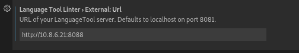

Languagetool is a grammar checker, deployed on our server with N-gram enhancement.
It is useful for example when you write your paper.
You can configure your source editor to connect to the server.

## VScode
Install `LanguageTool Linter` and use external url:

## Texstudio
Also change the server url to `http://10.8.6.21:8088`.
