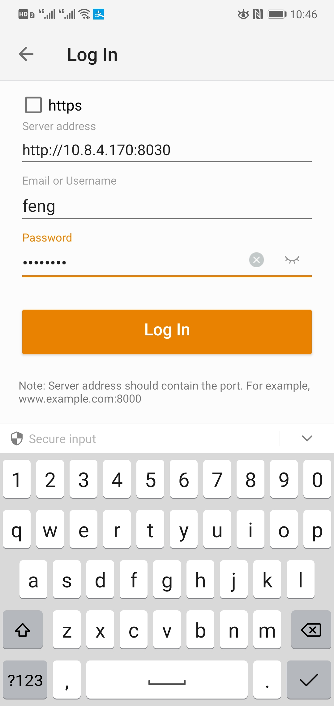

# Seafile
使用ssh登录的用户名和密码登录 [seafile cloud storage](http://10.8.6.22:8030/)。

## Service starting up
In the case where seafile and seahub services are down, we can reboot it manually by
```bash
cd /data1/seafile-server/seafile-server-7.0.5
bash seafile.sh start # root priviledge
bash seahub.sh start # root priviledge
```

## Advantages

* 微信电脑与手机互传文件有诸多限制，替代之。
* fast speed and large space
* mobile client support

## Use cases

1. Download the `seafile` mobile client from the Huawei Market.

2. Add our server and login use your ssh account.



3. Upload your files from mobile to the server.


4. (optional) Download your files from desktop browser client.

# SSH
## About ssh in general
SSH client has a configuration file. On macos it is located at `/etc/ssh/ssh_config`. It forwards `LC_*` and `LANG` environment variables to the server you ssh to by default. If these environment variables are not set properly, they could cause problems. See [locale setting](https://askubuntu.com/questions/412495/setlocale-lc-ctype-cannot-change-locale-utf-8) and [ssh forwarding env](https://superuser.com/questions/513819/utf-8-locale-portability-and-ssh) for detailed explanation.

## How to upload files to server
### GUI
`sftp` is recommended
### scp
Using `scp` you can upload one file or file glob to or from the server.
### rsync
If you need to upload multiple files within a directory or upload large files, you can use `rsync`.

On Windows platform, you can use Mobaxterm local terminal to finish this job. First `cd /drives/c/[your large files on disk C]` to your file. Then 
```shell
rsync -av --progress your_file user@10.8.6.21:/home/user/[your path]
```

# Overleaf
Our server has deployed the overleaf community server.
To start use it, visit [overleaf](http://10.8.6.21:8031).

# NFS
If you use unix system for your workstation, you can mount our nfs server by

```shell
sudo apt-get install nfs-common # Ubuntu
sudo mkdir -p /mnt/server
sudo mount 10.8.6.21:/data /mnt/server
```

Limitations: you may not have proper access to your home directory. A possible solution is to change your local user id and group id to match the
remote one.