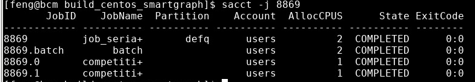

`slurm` is our workload manager. Here are some tips:

1. If you need to specify the node to run your program use:

    ```shell
    #SBATCH --nodelist=node03
    ```

    in your script.

    For `srun`, you can use `srun -w node01 echo "hello world".
    
2. If you need more cpu resources to run your program, add

   ```shell
   #SBATCH -c 4
   ```
   Or you can use `srun -c 4 your_multi_threaded_or_multi_process_program`.
   
   That is, you require 4 cpus to run your program.
   By default, you only have one physical cpu if not specified. This cpu has 2 logical cores. You can request maximum 32 cpus.
   
3. You can submit several serial programs within one job and run them in parallel.

    ```shell
    #!/bin/bash
    srun your_first_program -options &
    METHOD=cpu_forward srun your_second_program -options &
    wait
    ```

    You should add `&` to each `srun`. Also, do not forget `wait` at the very end.

    After job finishes, you can check the detail by `sacct -j your_job_id`. It may shows how the job is decomposed into 2 tasks which are running in parallel.

    

4. Check cpu and memory usage of other nodes

    ```shell
    srun --nodelist=node02 ps -u feima -o pid,user,%mem,%cpu,cmd
    ```
5. submit array jobs
   See [Introduction to array jobs](https://slurm.schedmd.com/job_array.html). 
   For 2d array jobs. see usage example of [2d array jobs](https://wiki.anunna.wur.nl/index.php/Array_jobs)

6. neural network library using cpus
   If your gpu resource limit is hit or you want to train your neural network using CPU. You can explicitly do this by specificying
   some environment variable. See [Python Guide](./python.md) for detail.

7. Interactive Shell
   ```shell
   srun --gres=gpu:1 -t 500 --pty bash
   ```
   You can use this method to debug your GPU program. Please quit it after your debugging session. This slurm job will also occupy one GPU.
   You can use `tmux` in this temporary session to open multiple windows. This is useful when you need to inspect the resource usage of current node with `top` or `/cm/local/apps/cuda/libs/current/bin/nvidia-smi`.
   Notice that all your tmux sessions are killed if you quit the shell. This behaviour is different with normal tmux usage.