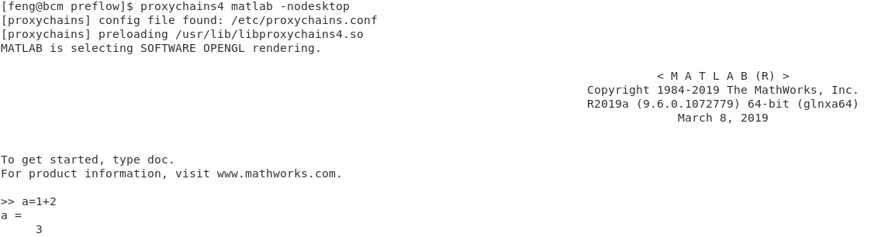
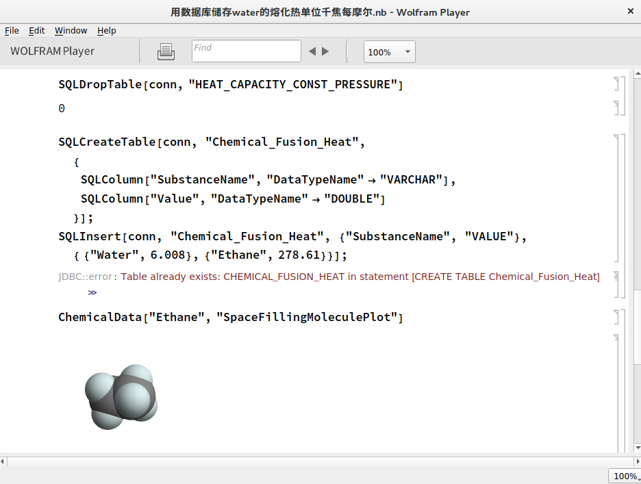

## Matlab
If you want to use, type `module load matlab`.

### GUI
You can use GUI matlab to explore small dataset or plot figures for your paper.

Warning: Do not use GUI mode to run large-scale experiment. GUI is run on manage node and will use all CPUs if parallelism is enabled. This will cause the instability of the system.

If you connect the server via X11 or vnc desktop, you can start matlab by `proxychains4 matlab`.


### Non-GUI
Under normal SSH login, you can invoke matlab by `proxychains4 matlab -nodesktop`. Notice this software is experimental supported by lab2c web admin.
Matlab may not start as you want.


### Script Mode
```shell
proxychains4 matlab -nodesktop -nosplash -nodisplay -r "run('path/to/your/script.m');exit;"
```

### Large Scale Computation
You can use `srun` to submit matlab job to compute node.

## Mathematica
You can use the storage node to run mathematica player. This software can view the Mathematica notebook. Type `WolframPlayer`
to open the software.



You can also run Mathematica Computing Engine within Raspberry Pi. We have deployed [3 raspberries](http://10.8.4.170:88/zhaofeng-shu33/slurm-test-env) in our labs.
See [wolfram](https://www.wolfram.com/raspberry-pi/) for detail.

After ssh to the raspberry OS, type `wolfram` to start symbolic computing:
```
pi@raspberrypi:~ $ wolfram
Mathematica 12.0.1 Kernel for Linux ARM (32-bit)
Copyright 1988-2019 Wolfram Research, Inc.

In[1]:= 1+2                                                                                                                                                             

Out[1]= 3

In[2]:= Quit[]                            
```
## Texworks
You can use the storage node to run texworks.


## Inkscape
You can use `inkscape` to make vector graphs, which are suitable for paper embedded figures.
