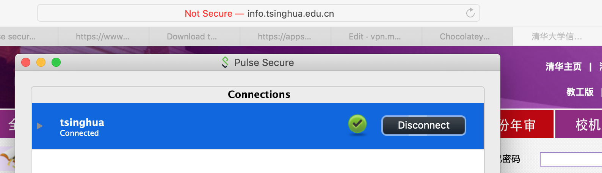
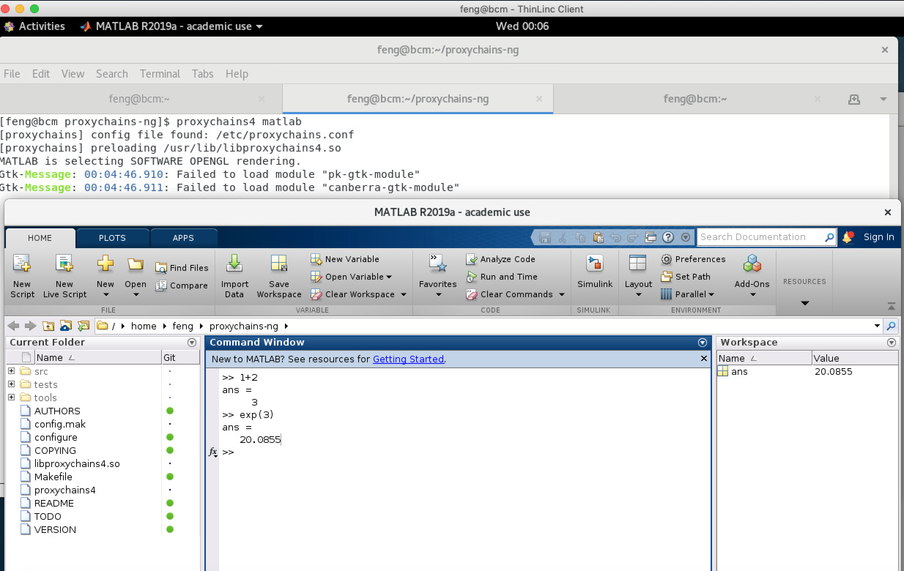

# 官方VPN
官方VPN目前有两个，一个指校本部的 VPN（pulse secure），另一个指清华深研院的VPN (easy connect)
## 清华深研院的VPN 
目前使用清华深研院的VPN可以在外网连接实验室服务器。请从 [http://vpn.sz.tsinghua.edu.cn](http://vpn.sz.tsinghua.edu.cn) 下载相应的客户端。
下载安装打开VPN，服务器地址填 [https://vpn.sz.tsinghua.edu.cn](https://vpn.sz.tsinghua.edu.cn)，
VPN 初始用户名是学号，初始密码是身份证后8位。

由于该VPN 5分钟内无连接即自动断开，给使用SSH 造成不便，建议通过设置客户端`ssh_config`中添加：
```
ServerAliveInterval 30
ServerAliveCountMax 60
```
本地 ssh 每隔30s向 server 端 sshd 发送 keep-alive 包，如果发送 60 次，server 无回应断开连接。

虽然官网上可以下载Linux 的客户端，但客户端比较旧了，据说只支持 Ubuntu 16.04, Ubuntu 17.04.

## 校本部的VPN
智园和大学城的网络做过特殊处理，可以直接访问 info 等网站，但有些站点还不行（比如软件中心下载软件、激活 Win10、Matlab 等），此时要用到 校本部 VPN
客户端 pulse secure。
Windows 和移动端下载地址 在 [https://sslvpn.tsinghua.edu.cn](https://sslvpn.tsinghua.edu.cn) 页面可以找到。
Mac 下载地址学校官方没有提供，可以自行搜索，这里给出开发这个客户端软件的公司提供的下载地址（国外网站，客户端下载速度较慢）：
* [MacOS](http://trial.pulsesecure.net/clients/ps-pulse-mac-9.0r4.0-b1731-installer.dmg)

官网上下载的Linux 的客户端，无法成功使用；[openconnect](https://www.infradead.org/openconnect/index.html) 可以用（不可用了）：
```
sudo /usr/local/sbin/openconnect --protocol=nc https://sslvpn.tsinghua.edu.cn
```

使用时，地址是 https://sslvpn.tsinghua.edu.cn, 用户名和密码与 info 相同。
以下是 Mac 版本的使用截图


## 自建内网穿透
如果你使用其他 Linux 发行版的操作系统，很可能无法使用官方VPN外网接入实验室服务器，此时可以用自建内网穿透的方式，
比如 [ssh 端口转发](https://www.cnblogs.com/zhaofeng-shu33/p/10685685.html) 或者 搭建[frp](https://github.com/fatedier/frp)
服务。由于智园网络不是很稳定以及这两种方式本身的局限性，可能会断掉。断掉后可以结合官方VPN重启。

## GFW
See [How to break through GFW](http://10.8.4.170/wiki/index.php/Guild_gfw)

## windows proxy server 与 proxychains 配合
### 背景
* 装学校 Linux 版  Matlab 会遇到 matlab 启动时连学校服务器 matlab.cic.tsinghua.edu.cn，但在智园的网络环境下这个 ip 是校本部内网无法访问，因此 正版matlab 无法启动。
* 假如你的工作站用 Linux 操作系统，已知 YangLi 用 Ubuntu, zhaofeng-shu33 在深研院用 Fedora，则无法使用 VPN 客户端连接特定的服务。
## Solution
为解决 Linux 操作系统不能用校本部和深研院 VPN 的问题，或更广泛地说，如何在 Linux OS 中使用 Windows VPN ，经过 zhaofeng-shu33 一番探索，提出如下的解决方案：通过 windows 虚拟机与特定的网络配置实现。

### Path
1. linux os 可以通过 wine 运行 windows exe，但对于涉及复杂网络配置的 vpn client, wine 的思路应该是行不通的，即使可以运行，linux os 也无法利用 client 弄出来的 network adapter。
1. windows 虚拟机的思路很容易想到，但如何将 windows 作为网关是一个难题。 win 10 虚拟机不是 win server，自带的 network 模块受限制，比如有名的 RRAS(routing and remote access service)虽然可以开启服务但无法使用管理工具，因此笔者在一番尝试下发现行不通。
1. 于是采用 windows proxy server 的方法， 同样因为 IIS 作 proxy 功能太弱，笔者费了一番功夫找到了一个开源的 cross-platform 的 proxy server 名字叫 [3proxy](https://github.com/z3APA3A/3proxy)，这个项目文档做的不好，经过一番探索才跑起来 server。
1.  linux os 如何使用搭建好的 proxy server 也是个难题，CentOS 7 实际并没有 system proxy 这一概念，有的 network client 是不会用你设置好的 http proxy 环境变量的。为此，只能在底层做一些改动强制软件如 matlab 使用 proxy。笔者找到了一个开源的 UNIX 平台的 [proxychains4](https://github.com/rofl0r/proxychains-ng)

### 最终网络结构
eth0 是一个内网，中心型拓扑结构
* 管理节点 10.1.1.254 （如下4台机器的网关和DNS服务器）
* 计算节点1 10.1.1.1
* 计算节点2 10.1.1.2
* 计算节点3 10.1.1.3
* Win10 10.1.1.4 （运行 3proxy service）

在其他机器上（非Win10），通过 3proxy 可访问到 matlab.csc.tsinghua.edu.cn

```shell
curl --socks 10.1.1.4:1080 matlab.cic.tsinghua.edu.cn:27000
curl --proxy 10.1.1.4:3128 matlab.cic.tsinghua.edu.cn:27000
```
curl 客户端通过命令行参数可以指定 proxy server，但 matlab 不行。

### 具体步骤
这里以服务器的管理节点为例，对于工作站，也是类似的。

1. 首先要在管理节点安装 VMWare Win10 虚拟机，配置网络环境为 Bridge，使用管理节点的 etho adapter，这里可能需要解锁 vmware 的一个高级功能，参考 [wiki](http://10.8.4.170/wiki/index.php/Admin)：
配置静态ip, network mask, gateway, dns server ip ， 然后确保 win10 可以上外网. 打开 win10 icmp firewall 的限制。在管理节点可以 ping 通 10.1.1.4。

1. 然后在 Win10 上安装 3proxy pre-built binary. 完成相关的配置，其中的要点有：取消 proxy 密码限制，打开对 3proxy service 的 firewall restriction。在管理节点使用 curl 命令测试 proxy server 是否正常。

1. 在管理节点编译安装 proxychains，修改 `/etc/proxychains.conf`，其中的要点有取消对 dns 请求的代理，对 localhost 的代理。然后用 `proxychains matlab` 启动 matlab图形化界面。matlab 命令行初始化需要一点时间，需要等待半分钟左右。

最终启动效果图如下：


目前 matlab 装到了集群共享目录 `/cm/shared/modulefiles/matlab` 下面

通过在其他计算节点下安装 proxychains 并集成好，配置好 module load/unload matlab，可以实现对最终用户无感地使用 matlab,并且能以 shell mode 启动，通过 slurm 以 batch mode 完成大型计算任务等。

### Known Issues
* Win10 虚拟机目前是以 feng 用户启动的，有无可能以 daemon 启动。3proxy 已经注册为 Win 10 service, 不需要用户登录 Win10 即可在后台运行。
* Win10 安装了校本部 VPN 客户端，用的是 zhaofeng-shu33 的账号，需要一直保持连接。

## OpenVPN
在实验室服务器管理节点部署 OpenVPN Server, 客户端安装 OpenVPN Client 后可直接访问到集群内网（计算节点和Win虚拟机），比如 ping 通 `10.1.1.2`（node02 的 ip）。
安装 Client 后，要手动导入根证书，root certificate 在服务器 `/usr/share/doc/openvpn-2.4.6/sample/sample-keys/ca.crt` 的位置上。
将该文件下载到本地，client config file 里 ca 换成本地 ca.crt 的绝对路径，注释掉 `cert` 和 `key` 的配置。
添加 server ip 地址： `remote 10.8.4.170 1194` 及 使用用户名密码校验：`auth-user-pass`（与 ssh 登陆用户名与密码相同）。